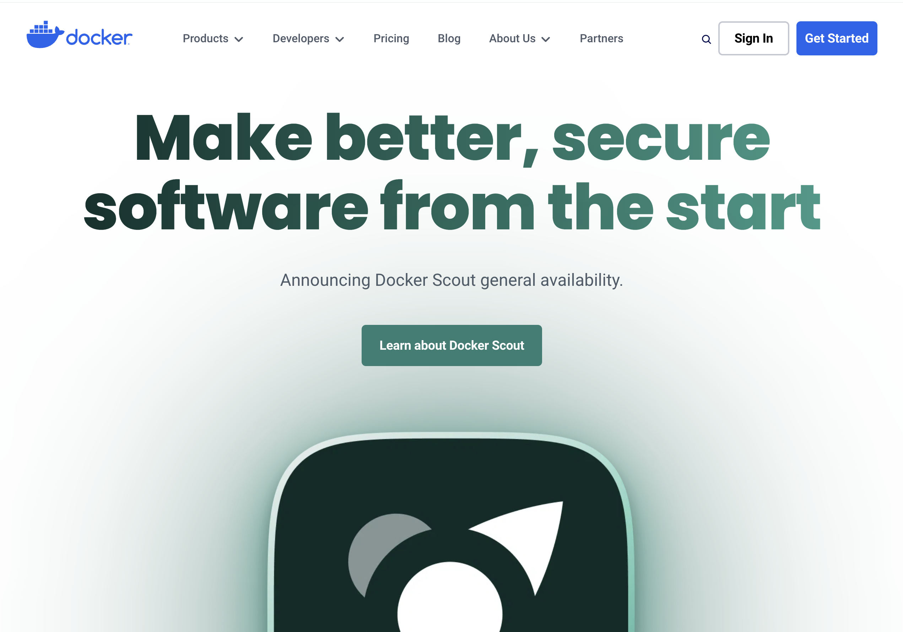

# 🐳 Docker Download

Docker 공식 사이트 또는 Docker hub에서 본인 사양에 맞는 설치 파일을 다운로드한다.  
<a href="https://docs.docker.com/desktop/install/mac-install/">도커 공식 홈페이지</a>

사이트에 들어가면 Get Started를 눌러줍니다. 그럼 다음과 같이 본인의 환경에 맞게 install 할 수 있는 창이 뜹니다.

docker가 다운로드 되었는지 확인하시고 싶으시면 터미널에 `docker` 또는 `docker --version`을 입력해주세요
