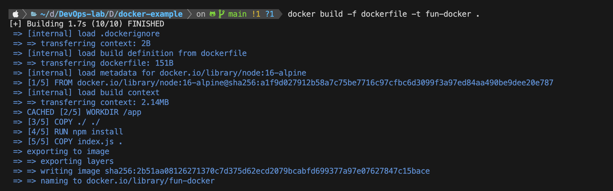
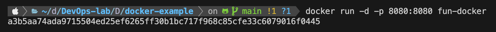
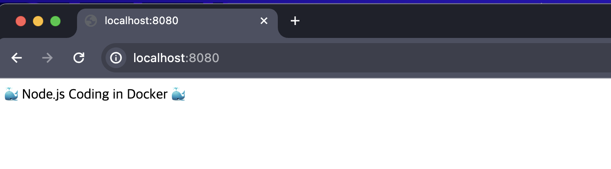
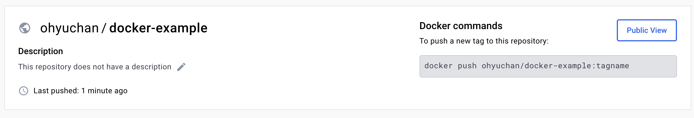
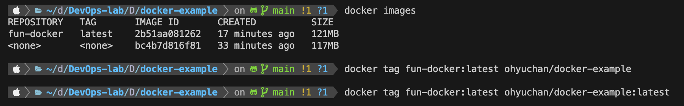
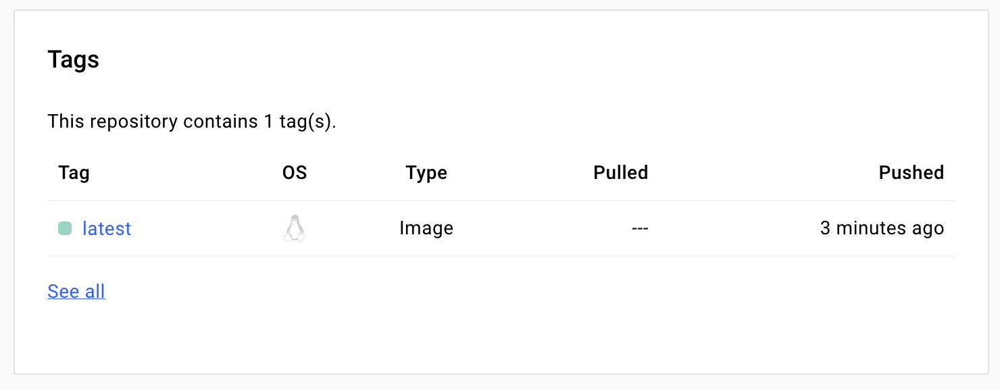

# 🐳 docker-example

이번 docker-example 파일은 Node.js를 통해서 심플한 텍스트를 출력하는 어플을 작성하였습니다.

Docker 파일은 Layer 형태로 작성하는 것이 좋은데 가장 빈번이 변경되는 것은 나중에 작성하는 것이 좋습니다.
Docker build `docker build -f dockerfile -t fun-docker .`

`.` : build context 명령어를 수행하는 현재 경로를 지정  
`-f` : f 옵션은 어떤 도커 파일을 명시해줄 수 있습니다.  
`-t` : t 옵션은 도커 이미지의 이름을 부여할 수 있습니다.

Docker 실행 `docker run -d -p 8080:8080 fun-docker`

`-d` : d 옵션은 detached를 의미합니다. 백그라운드에서 도커가 동작해야 하므로 터미널이 기다려야 하는데 실행하는 동안 터미널이 계속 기다려야 합니다. 이 명령어를 수행하고 끝날 때까지 기다리지 말고 진행하는 동안 터미널에게 터미널이 하는 일 해 detached 하라는 의미입니다.

`-p` : p 옵션을 통해서 포트를 지정해줍니다. 호스트 머신의 8080과 컨테이너의 8080 포트를 연결해주는 기능

`localhost:8080`에 접속 해보면 아래와 같은 결과를 볼 수 있습니다.

## 🐳 Docker Image Unload

Dockerhub에 가서 `create Repository`를 클릭하고 Repository의 이름을 입력하면 다음과 같이 옆에 push하는 방법이 잘 설명되어 있습니다.

`docker images`를 해보면 기존에 설정해둔 이름과 다르기 때문에 `docker tag` 명령어를 통해 이름을 push 이름과 동일하게 변경해줘야 합니다.

그 후 `docker login`을 통해서 docker에 로그인 후 `docker push ohyuchan/docker-example:latest`를 하면 Dockerhub에 push한 이미지를 볼 수 있습니다.

